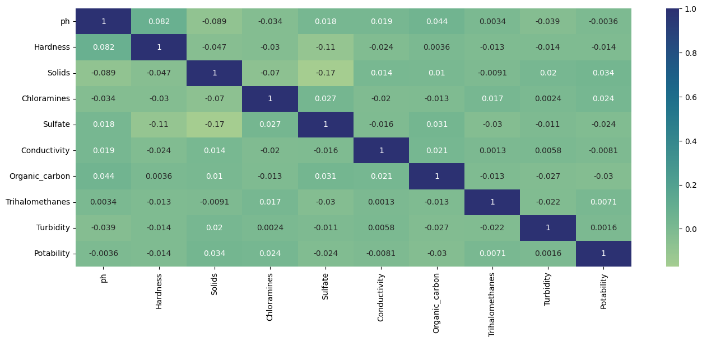
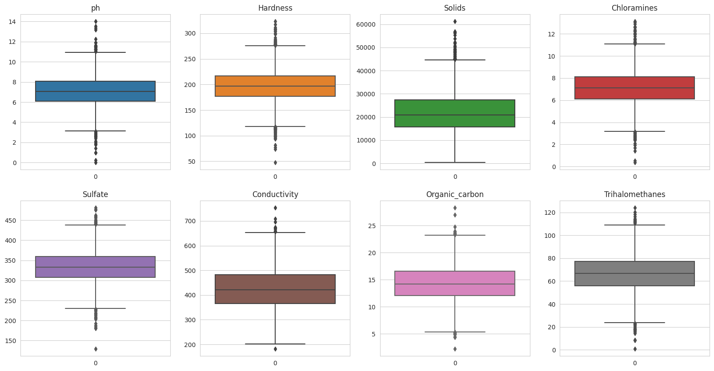
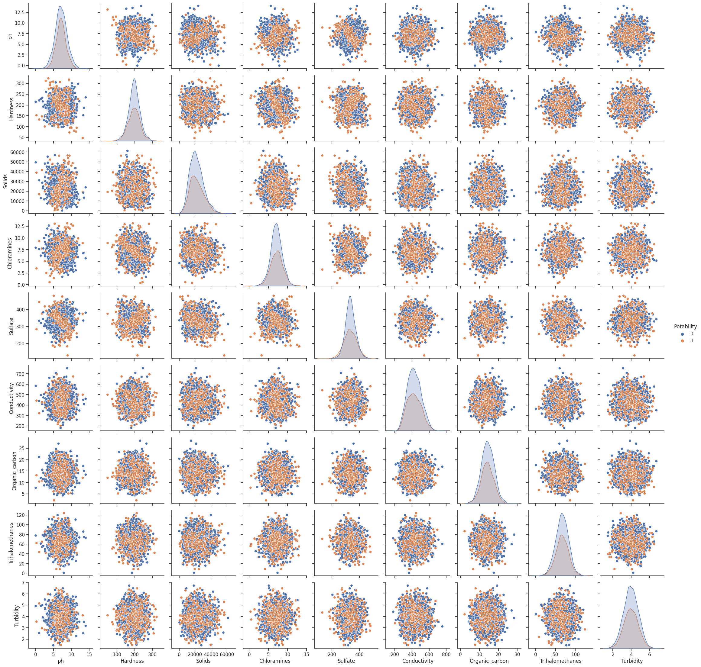

# Potability Prediction

This repository explores the Kaggle *Drinking Water Potability* dataset end-to-end—from exploratory analysis to supervised and unsupervised modelling—to determine whether a water sample is safe to drink.

## Project at a glance
- **Data**: 3,276 laboratory samples, 9 physicochemical measurements, binary `Potability` target (39% potable, 61% not potable).
- **Preprocessing**: Custom `tools.prep` pipeline replaces missing values (mean imputation) and scales features with `StandardScaler`; `tools.split` builds a 70/30 train/test split.
- **Modeling**: Six supervised learners (Logistic Regression, SVM, BernoulliNB, KNN, Random Forest, Gradient Boosting) plus PCA, K-Means, and DBSCAN for unsupervised insight. Tuned Gradient Boosting topped the leaderboard with 80.67% test accuracy and 70.39% F1.

## Visual snapshots
<figure>
	
	<figcaption>Exploratory analysis output illustrating the weak correlation structure across features.</figcaption>
</figure>

<figure>
	
	<figcaption>Selected descriptive statistics rendered during the EDA walkthrough.</figcaption>
</figure>

<figure>
	
	<figcaption>Example notebook artifact used to inspect predictive performance.</figcaption>
</figure>

## Dataset
- Source: [Drinking Water Potability (Kaggle)](https://www.kaggle.com/datasets/artimule/drinking-water-probability) stored locally in `dataset/drinking_water_potability.csv`.
- Missing data: `ph` 15.0%, `Sulfate` 23.8%, `Trihalomethanes` 4.9%; remaining variables are complete.
- Features (with shorthand descriptions): `ph`, `Hardness`, `Solids`, `Chloramines`, `Sulfate`, `Conductivity`, `Organic_carbon`, `Trihalomethanes`, `Turbidity`, and the binary `Potability` label.

## Repository layout
- `Exaploratory Data Analysis (EDA).ipynb`: Data quality checks, class imbalance review, and first-pass visualisations.
- `Model-building phase.ipynb`: Reproducible training pipeline covering preprocessing, tuning (grid/random search), evaluation, and unsupervised experiments.
- `tools.py`: Helper utilities (`prep`, `split`, `evaluate`, `improvements`) used across notebooks.
- `Models/`: Serialized estimators (`*.pkl`) for the tuned classifiers ready for reuse.
- `dataset/`: Raw CSV data required by the notebooks.

## Environment setup
1. Install Python 3.10+.
2. Create and activate a virtual environment (recommended).
3. Install the runtime dependencies:

```powershell
pip install numpy pandas scikit-learn matplotlib seaborn jupyter notebook
```

## Reproducing the analysis
1. Launch Jupyter Notebook in the repository root and open `Exaploratory Data Analysis (EDA).ipynb`.
2. Execute the EDA notebook top-to-bottom to inspect data integrity and feature behaviour.
3. Run `Model-building phase.ipynb` to recreate preprocessing, model training, hyper-parameter search (Grid/Random Search CV), and evaluation on the hold-out test set.
4. Saved models in `Models/` can be reloaded directly, e.g.:

```python
import pickle
model = pickle.load(open('Models/Gradient_Boosting_gs_w100.pkl', 'rb'))
```

## Model performance summary (test set)

| Model | Accuracy | Recall | Precision | F1-score |
|:--|--:|--:|--:|--:|
| Logistic Regression | 62.87% | 0.27% | 100.00% | 0.54% |
| Support Vector Machine | 69.28% | 29.78% | 70.78% | 41.92% |
| Bernoulli Naive Bayes | 62.05% | 30.87% | 48.50% | 37.73% |
| K-Nearest Neighbours | 64.50% | 27.87% | 54.55% | 36.89% |
| Random Forest | 79.96% | 54.64% | 86.58% | 67.00% |
| **Gradient Boosting** | **80.67%** | **62.02%** | **81.36%** | **70.39%** |

Gradient Boosting produced the best balance of sensitivity and precision, while Random Forest achieved the highest precision. Simpler linear models struggled with the class imbalance.

## Unsupervised learning takeaways
- PCA confirmed that at least seven principal components are needed to explain 80% of the variance—features are largely independent.
- K-Means (elbow analysis) and DBSCAN did not expose well-separated clusters, reinforcing the need for supervised approaches.
